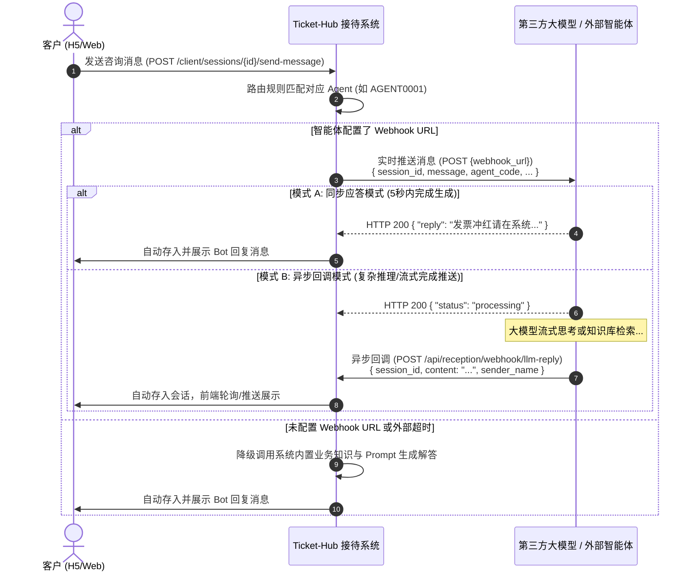

# 第三方大模型智能体消息推送与回调接口规范

## 1. 概述与交互架构

在发票云微系统（ticket-hub）的在线接待能力中，支持配置各业务领域的专业智能体（AI Agent）。客户接入在线咨询后，智能体将第一时间接入接待并自动解答客户疑问。

系统支持将客户提问**实时推送给第三方大模型服务/自研智能体**，并支持大模型**同步回复**或**异步回调推送回复**至客户会话窗口中。



---

## 2. 出站推送规范：Ticket-Hub → 第三方大模型

当智能体档案中配置了 **消息推送地址（Webhook URL）**，客户在会话中发送的每条业务咨询消息将由 Ticket-Hub 自动向该地址发起 HTTP POST 请求。

### 2.1 请求格式
- **请求方式**: `POST`
- **请求协议**: HTTP / HTTPS
- **请求头 (Headers)**:
  ```http
  Content-Type: application/json; charset=utf-8
  User-Agent: TicketHub-AgentWebhook/1.0
  X-Ticket-Hub-Event: client.message.created
  ```
- **超时设置**: 默认 5.0 秒超时。若第三方超过 5 秒未响应，Ticket-Hub 将记录告警并自动降级为内置知识作答，保障客户体验不挂死。

### 2.2 请求体 (JSON Payload)
```json
{
  "session_id": "ZXHH202609240001",
  "message": "请问电子发票冲红提示‘原发票状态不正确’怎么处理？",
  "agent_code": "AGENT0001",
  "agent_name": "数电发票专家 Agent",
  "company_name": "深圳市某某电子商务科技有限公司",
  "timestamp": "2026-09-24T14:30:00.000Z"
}
```

### 2.3 字段说明
| 字段名 | 类型 | 必填 | 说明 |
| :--- | :--- | :--- | :--- |
| `session_id` | string | 是 | 当前在线接待会话唯一编号，全局唯一且贯穿整个会话生命周期 |
| `message` | string | 是 | 客户发送的咨询文本正文 |
| `agent_code` | string | 是 | 当前响应接待的智能体编号（如 `AGENT0001`） |
| `agent_name` | string | 是 | 当前智能体名字（如 `数电发票专家 Agent`） |
| `company_name` | string | 否 | 客户所属企业名称（已认证企业带入，未识别则为空字符串） |
| `timestamp` | string | 是 | 消息发送时间戳 (ISO 8601 UTC) |

### 2.4 第三方同步应答规范 (模式 A)
如果第三方大模型服务可在 5 秒内完成计算并直接同步返回回复内容，Ticket-Hub 将直接解析该回复展示给客户。

- **HTTP 状态码**: `200 OK`
- **响应体示例**:
```json
{
  "status": "success",
  "reply": "您好！出现‘原发票状态不正确’通常是因为该张发票已被全额冲红、作废或税局端状态未同步。建议您进入【发票查询】中核对原发票最新状态，若确实未冲红，可等待5分钟后重试开具红字信息表。"
}
```
*注：系统兼容解析响应体中 `reply`、`content`、`message`、`text` 任意字段。*

---

## 3. 入站回调规范：第三方大模型 → Ticket-Hub (模式 B)

若第三方服务采用异步生成、流式拼接完毕后推送、或多智能体协同步调，第三方在收到消息并返回 `200 {"status":"processing"}` 后，可在生成完成时主动调用 Ticket-Hub 提供的回调接收接口。

### 3.1 接口地址与环境清单
- **UAT 预发环境（推荐第三方公网联调）**:
  - 主接口地址: `http://dl.piaozone.com:18025/ticket-hub-uat/api/reception/webhook/llm-reply`
  - 别名接口: `http://dl.piaozone.com:18025/ticket-hub-uat/api/reception/agent/external-message`
- **SIT 集成测试环境**:
  - 主接口地址: `http://43.139.250.182/hub-issue/api/reception/webhook/llm-reply`
  - 别名接口: `http://43.139.250.182/hub-issue/api/reception/agent/external-message`
- **本地联调环境**:
  - 接口地址: `http://localhost:8080/api/reception/webhook/llm-reply`
- **请求头 (Headers)**:
  ```http
  Content-Type: application/json; charset=utf-8
  ```

### 3.2 请求参数 (JSON Payload)
```json
{
  "session_id": "ZXHH202609240001",
  "content": "您好！关于您咨询的电子发票冲红疑问，经排查解决方案如下：\n1. 请检查原发票开具日期是否处于跨月状态；\n2. 确认税局端连接状态正常后重新同步发票信息。\n\n如需进一步协助，可回复‘未解决’申请转接人工坐席。",
  "sender_name": "数电发票专家 Agent",
  "agent_code": "AGENT0001"
}
```

### 3.3 字段说明
| 字段名 | 类型 | 必填 | 说明 |
| :--- | :--- | :--- | :--- |
| `session_id` | string | 是 | 会话唯一编号（与出站推送时收到的 `session_id` 一致） |
| `content` | string | 是 | 大模型生成的回复内容（支持包含换行排版与文字 Emoji） |
| `sender_name` | string | 否 | 发送者名称，用于会话窗口气泡显示（缺省时自动使用智能体名称或“智能助手”） |
| `agent_code` | string | 否 | 智能体编号（如 `AGENT0001`） |

### 3.4 响应结果
#### 成功响应 (`200 OK`)
```json
{
  "ok": true,
  "message_id": 10528,
  "session_id": "ZXHH202609240001",
  "sender_name": "数电发票专家 Agent",
  "created_at": "2026-09-24T14:30:05.123456Z"
}
```

#### 异常响应
- **404 Not Found**: 会话不存在。
  ```json
  { "detail": "会话不存在" }
  ```
- **400 Bad Request**: 会话已关闭或已转交。
  ```json
  { "detail": "当前会话已结束，不可追加消息" }
  ```

---

## 4. 接入代码示例

### 4.1 Python (FastAPI) 外部智能体接入示例

```python
import httpx
from fastapi import FastAPI, BackgroundTasks
from pydantic import BaseModel

TICKET_HUB_URL = "http://43.139.250.182/hub-issue"  # SIT环境基础路径；本地联调可用 http://localhost:8080

class InboundPushPayload(BaseModel):
    session_id: str
    message: str
    agent_code: str
    agent_name: str
    company_name: str = ""
    timestamp: str

def async_llm_inference_and_callback(session_id: str, question: str, agent_name: str):
    """模拟大模型调用与回调"""
    # 1. 调用大模型生成回答
    # response_text = your_llm_chain.invoke(question)
    response_text = f"【AI解答】已收到关于“{question}”的咨询。请登录系统检查开票参数与税局服务状态。"

    # 2. 异步回调推送到 Ticket-Hub
    callback_url = f"{TICKET_HUB_URL}/api/reception/webhook/llm-reply"
    callback_payload = {
        "session_id": session_id,
        "content": response_text,
        "sender_name": agent_name,
    }
    try:
        with httpx.Client(timeout=10.0) as client:
            client.post(callback_url, json=callback_payload)
    except Exception as e:
        print(f"Callback to Ticket-Hub failed: {e}")

@app.post("/webhook/ticket-agent")
def handle_agent_push(payload: InboundPushPayload, bg: BackgroundTasks):
    # 模式 B：异步触发推理并回调
    bg.add_task(async_llm_inference_and_callback, payload.session_id, payload.message, payload.agent_name)
    return {"status": "processing", "message": "Inference started"}
```

### 4.2 cURL 模拟异步回调测试

```bash
curl -X POST "http://dl.piaozone.com:18025/ticket-hub-uat/api/reception/webhook/llm-reply" \
  -H "Content-Type: application/json" \
  -d '{
    "session_id": "ZXHH202609240001",
    "content": "您好！这是第三方大模型通过异步接口推送的专业解答内容。",
    "sender_name": "数电发票专家 Agent",
    "agent_code": "AGENT0001"
  }'
```

---

## 5. 最佳实践与注意事项

1. **会话生命周期校验**:
   - 若客户主动点击【结束服务】或已转化为工单，会话状态将翻转为 `closed` 或 `converted`。第三方异步回调推送时若收到 `400`，应立即终止后续重试。
2. **幂等性保障**:
   - 推送网络发生波动时，可按需重试；Ticket-Hub 会为每次追加生成独立的消息记录。建议第三方大模型侧控制单次提问的并发回调次数。
3. **未解决转人工引导**:
   - 外部大模型如果判定客户问题超出自动作答能力，可在回复内容末尾引导客户回复“未解决”，系统将自动触发实时在岗探针并引导转接人工或提单。
